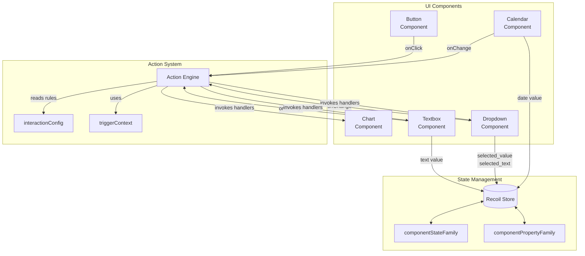
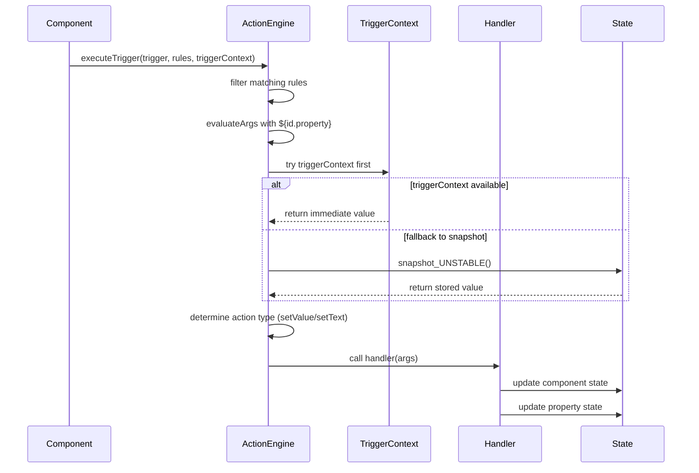

# Development Guide

This document provides an overview of the development workflow and architecture for the project. It covers environment setup, code organization, and the internal mechanics that connect UI components with the action engine.

## Environment Setup

1. **Install dependencies**:
   ```bash
   npm install
   ```
2. **Start the development server**:
   ```bash
   npm run dev
   ```
3. **Build for production**:
   ```bash
   npm run build
   ```
4. **Run tests**: (currently none specified)
   ```bash
   npm test
   ```

## Project Structure

```
📦 d-react-sample
├── src
│   ├── components
│   │   ├── ButtonComponent.tsx
│   │   ├── CalendarComponent.tsx
│   │   ├── ChartComponent.tsx
│   │   ├── DropdownComponent.tsx
│   │   └── TextboxComponent.tsx
│   ├── config
│   │   ├── interactionConfig.ts
│   │   ├── pageConfig.json
│   │   └── types.ts
│   ├── engine
│   │   └── actionEngine.ts
│   ├── atoms.ts
│   ├── App.tsx
│   └── main.tsx
└── docs
    └── development.md
```

## Architecture Overview

The application renders dynamic dashboard widgets with five core component types. Components communicate through a lightweight action engine with property-based bindings driven by configuration.



## Action Engine Flow

The action engine supports property-based bindings with immediate value resolution through triggerContext and fallback to Recoil snapshots. It intelligently maps target properties to appropriate action handlers.



## Component Types and Properties

### CalendarComponent
- **Properties**: `value` (date string)
- **Triggers**: `${id}.onChange` when date is selected
- **Handlers**: `setValue` for external updates

### ButtonComponent  
- **Properties**: `value` (timestamp)
- **Triggers**: `${id}.onClick` when clicked
- **Handlers**: `setValue` for external updates

### ChartComponent
- **Properties**: `value` (date string for data loading)
- **Triggers**: None (pure consumer)
- **Handlers**: `setValue` triggers async data loading and chart rendering

### DropdownComponent
- **Properties**: 
  - `value` (selected option value - backward compatibility)
  - `selected_value` (selected option value)
  - `selected_text` (selected option label/text)
- **Triggers**: `${id}.onChange` with all property values in triggerContext
- **Handlers**: `setValue` updates all properties maintaining sync

### TextboxComponent
- **Properties**:
  - `value` (text content - backward compatibility) 
  - `text` (text content)
- **Triggers**: `${id}.onChange` with both property values in triggerContext
- **Handlers**: `setValue` and `setText` for different binding targets

## Dynamic Page Configuration

The dashboard is assembled from `pageConfig.json`, which declares components and their property-based bindings.

```json
{
  "components": [
    { "id": "calendar-1", "type": "calendar" },
    { "id": "button-1", "type": "button", "props": { "label": "Load Chart 2" } },
    { "id": "chart-1", "type": "chart" },
    { "id": "chart-2", "type": "chart" },
    {
      "id": "dropdown-1",
      "type": "dropdown",
      "props": {
        "placeholder": "Select an option",
        "options": [
          { "label": "Apple", "value": "apple" },
          { "label": "Banana", "value": "banana" }
        ]
      }
    },
    { "id": "textbox-1", "type": "textbox", "props": { "placeholder": "Mirror selection" } }
  ],
  "bindings": [
    { "source": "calendar-1", "target": "chart-1", "mode": "direct" },
    { "source": "calendar-1", "target": "chart-2", "mode": "indirect", "via": "button-1" },
    { 
      "source": "dropdown-1", 
      "source-property": "selected_value", 
      "target": "textbox-1", 
      "target-property": "text", 
      "mode": "direct" 
    }
  ]
}
```

### Configuration Elements

- **components**: Lists widgets to render with optional props including labels, placeholders, and dropdown options
- **bindings**: Connect component properties with enhanced control:
  - `source`/`target`: Component IDs to connect
  - `source-property`: Which property to read from source (defaults to "value")
  - `target-property`: Which property to write to target (defaults to "value") 
  - `mode`: "direct" for immediate updates, "indirect" for button-mediated updates
  - `via`: Required for indirect mode - the button component that triggers the update

### Property-Based Binding Examples

**Bind dropdown's selected text (label) to textbox:**
```json
{
  "source": "dropdown-1",
  "source-property": "selected_text",
  "target": "textbox-1", 
  "target-property": "text",
  "mode": "direct"
}
```

**Bind dropdown's value via button click:**
```json
{
  "source": "dropdown-2",
  "source-property": "selected_value",
  "target": "textbox-2",
  "target-property": "text", 
  "mode": "indirect",
  "via": "button-2"
}
```

The interaction rules consumed by the action engine are automatically derived from this configuration. The system intelligently maps `target-property: "text"` to `setText` actions and other properties to `setValue` actions.

## State Management System

The application uses Recoil with two key selector families for flexible component state management:

### componentStateFamily
- **Purpose**: Backward-compatible component state access
- **Usage**: `useRecoilState(componentStateFamily(id))`
- **Behavior**: Returns the component's primary value, handling both simple values and object structures

### componentPropertyFamily  
- **Purpose**: Property-specific state access for enhanced bindings
- **Usage**: `useRecoilState(componentPropertyFamily({ id, property }))`
- **Behavior**: Manages specific properties like `selected_value`, `selected_text`, `text`
- **Auto-conversion**: Automatically converts simple values to object structures when needed

```ts
// Example: Managing dropdown properties
const [selectedValue, setSelectedValue] = useRecoilState(
  componentPropertyFamily({ id: 'dropdown-1', property: 'selected_value' })
);
const [selectedText, setSelectedText] = useRecoilState(
  componentPropertyFamily({ id: 'dropdown-1', property: 'selected_text' })
);
```

## Adding a New Component

1. **Create the component** inside `src/components` and expose an `id` prop.

2. **Set up state management** with appropriate properties:
   ```ts
   const [value, setValue] = useRecoilState(componentStateFamily(id));
   const [specificProp, setSpecificProp] = useRecoilState(
     componentPropertyFamily({ id, property: 'specific_prop' })
   );
   ```

3. **Register action handlers** for external control:
   ```ts
   useEffect(() => {
     registerActionHandler(id, 'setValue', ({ value }) => {
       setValue(value);
       setSpecificProp(value); // Keep properties in sync
     });
     // Add property-specific handlers if needed
     registerActionHandler(id, 'setSpecificProp', ({ specific_prop }) => {
       setSpecificProp(specific_prop);
       setValue(specific_prop); // Maintain backward compatibility
     });
   }, [id, setValue, setSpecificProp]);
   ```

4. **Emit triggers** with triggerContext for immediate value resolution:
   ```ts
   const handleChange = (newValue) => {
     setValue(newValue);
     const triggerContext = {
       [id]: {
         value: newValue,
         specific_prop: newValue
       }
     };
     executeTrigger(`${id}.onChange`, interactionConfig, triggerContext);
   };
   ```

5. **Update configuration**: Add the component and bindings to `pageConfig.json` with appropriate property specifications.

## Styling and Dependencies

- Styling is handled via simple inline styles; feel free to integrate a CSS framework.
- State management uses [Recoil](https://recoiljs.org/).
- Charts are rendered with [ECharts](https://echarts.apache.org/).

## Contributing

1. Fork the repository and create a feature branch.
2. Commit with meaningful messages.
3. Ensure the development server and tests run without errors.
4. Submit a pull request for review.
