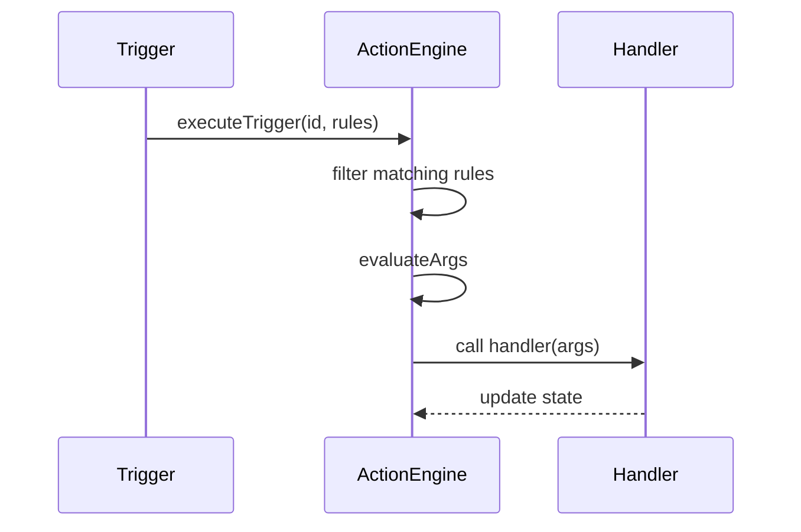

# Development Guide

This document provides an overview of the development workflow and architecture for the project. It covers environment setup, code organization, and the internal mechanics that connect UI components with the action engine.

## Environment Setup

1. **Install dependencies**:
   ```bash
   npm install
   ```
2. **Start the development server**:
   ```bash
   npm run dev
   ```
3. **Build for production**:
   ```bash
   npm run build
   ```
4. **Run tests**: (currently none specified)
   ```bash
   npm test
   ```

## Project Structure

```
📦 d-react-sample
├── src
│   ├── components
│   │   ├── ButtonComponent.tsx
│   │   ├── CalendarComponent.tsx
│   │   └── ChartComponent.tsx
│   ├── config
│   │   ├── interactionConfig.ts
│   │   ├── pageConfig.json
│   │   └── types.ts
│   ├── engine
│   │   └── actionEngine.ts
│   ├── atoms.ts
│   ├── App.tsx
│   └── main.tsx
└── docs
    └── development.md
```

## Architecture Overview

The application renders dynamic dashboard widgets. Users can add calendars, buttons, and charts at runtime. Components communicate through a lightweight action engine driven by configuration.

```mermaid
graph TD
    subgraph UI
        A[Calendar]\nComponent
        B[Button]\nComponent
        C[Chart]\nComponent
    end
    A -- updates value --> S[(Recoil Store)]
    B -- onClick --> AE(Action Engine)
    AE -- reads --> CFG[interactionConfig]
    AE -- invokes --> C
    C -- writes --> S
```

## Action Engine Flow

The action engine reacts to triggers defined in `interactionConfig` and calls registered handlers on target components.



## Dynamic Page Configuration

The dashboard is assembled from `pageConfig.json`, which declares components and their bindings.

```json
{
  "components": [
    { "id": "calendar-1", "type": "calendar" },
    {
      "id": "button-1",
      "type": "button",
      "props": { "label": "Load Chart 2" }
    },
    { "id": "chart-1", "type": "chart" },
    { "id": "chart-2", "type": "chart" }
  ],
  "bindings": [
    { "source": "calendar-1", "target": "chart-1", "mode": "direct" },
    {
      "source": "calendar-1",
      "target": "chart-2",
      "mode": "indirect",
      "via": "button-1"
    }
  ]
}
```

- **components** lists widgets to render along with optional props.
- **bindings** connect component values. `mode: "direct"` updates the target whenever the source changes. `mode: "indirect"` delays the update until the specified component (such as a button) fires its trigger.

The interaction rules consumed by the action engine are derived from this configuration, so editing the JSON payload is enough to rewire the dashboard.

## Adding a New Component

1. **Create the component** inside `src/components` and expose an `id` prop.
2. **Register action handlers** if the component should react to triggers:
   ```ts
   useEffect(() => {
     registerActionHandler(id, 'actionName', handlerFn);
   }, [id]);
   ```
3. **Update configuration**: Add corresponding rules to `pageConfig.json`.

## Styling and Dependencies

- Styling is handled via simple inline styles; feel free to integrate a CSS framework.
- State management uses [Recoil](https://recoiljs.org/).
- Charts are rendered with [ECharts](https://echarts.apache.org/).

## Contributing

1. Fork the repository and create a feature branch.
2. Commit with meaningful messages.
3. Ensure the development server and tests run without errors.
4. Submit a pull request for review.
